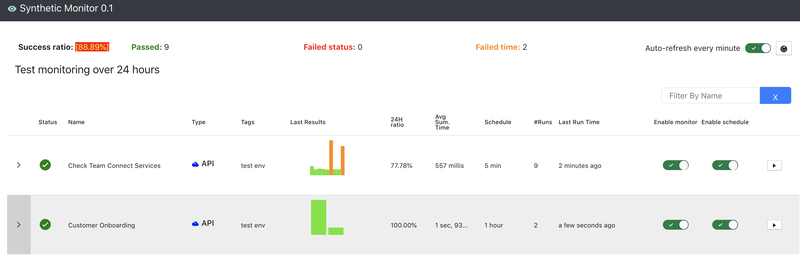

# synthetic-monitor

A simple tool for executing synthetic monitoring on websites or webservices. 
The main benefit of this tool is that api or simulated transactions can be declared 
using simple YAML language rather than code. 
     
The synthetic-monitor tests currently supports the following functionalities:
- Can be invoked via scheduler, directly via API or the web-based front end 
- Tests can be loaded from files, and can be managed via API or the web-based frontend
- Each synthetic-monitor test can have one or more synthentic test actions 
- The following test action is supported: 
  - API action 
     - GET 
     - POST 
     - PUSH 
     - DELETE      

## Getting Started

These instructions will get you a copy of the project up and running on your local machine for development and testing purposes. See deployment for notes on how to deploy the project on a live system.

### Prerequisites

What things you need to install the software and how to install them

1. [Git commandline](https://git-scm.com/downloads)
2. [OpenJDK11](https://openjdk.java.net/) 
3. [ReactJS](http://reactjs.org/) 
4. [NodeJS](https://nodejs.org/en/)
3. Eclipse / IntelliJ / Any other Java IDE that supports maven build process

### Installing

A step by step series of examples that tell you how to get a development env running
 - Import the project into Eclipse/IntelliJ
 - Add Maven pom.xml to your project
 - Run SyntheticMonitorApplication.java 

Please refer to the synthetic monitor test yaml files at ./api/data/demo-yaml and the tests under 
./api/src/test/java/com/gkh/syntheticmonitor/model to get an understanding on how to write a YAML test.

## Deployment
 
 - To deploy the app as docker container:
    - docker-compose -f /Users/gohk/IdeaProjects/synthetic-monitor/docker-compose.yml build
    - docker-compose -f /Users/gohk/IdeaProjects/synthetic-monitor/docker-compose.yml up  

## Built With

* [SprintBoot](http://spring.org/) - Spring Boot 2.2.4
* [OpenJDK11](https://openjdk.java.net/) - For building the backend
* [Maven](https://maven.apache.org/) - Dependency Management for Java/Springboot
* [ReactJS](http://reactjs.org/) - For the frontend

## Roadmap

* Frontend
    - Search functionality in the overview monitoring page
    - Proper KPI dashboard
    - Test Editors
    - Aggregated report (weekly, monthly)
* Backend
    - Assert actions via script (similar to Postman)
    - Actions:
      - Puppeteer action
      - JDBC action
      - ...
    - Alarm
      - Email
      - Slack
      - API hook
      - ...
     

## Contributing

Please read [CONTRIBUTING.md](https://gist.github.com/PurpleBooth/b24679402957c63ec426) for details on our code of conduct, and the process for submitting pull requests to us.

## Versioning

## Authors

* **Kenny Goh** - *Initial work* - [KG](https://github.com/Kenny-goh)

See also the list of [contributors](https://github.com/your/project/contributors) who participated in this project.

## License

This project is licensed under the MIT License - see the [LICENSE.md](LICENSE.md) file for details

